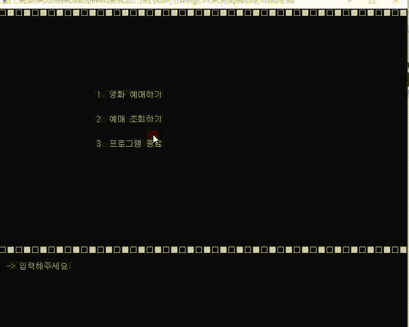

프로젝트 포트폴리오 ([**Project Portfolio**](https://github.com/Park-New-project))
=============

### 4학년 1학기
* [**FoodPass - 푸드트럭 스마트 오더 웹앱 서비스**](https://github.com/Park-New-project/FoodPass)

### 3학년 2학기
* [**CrowdF - 크라우드 펀딩 웹서비스 (CrowdFunding Web Service)**](https://github.com/Park-New-project/CrowdfundingWebService)

### 3학년 1학기
* [**Unity 하노이 탑 (Tower of Hanoi(BFS))**](https://github.com/Park-New-project/Tower_of_Hanoi_BFS)

* [**HanChat - 준비물 관리 챗봇 시스템**](https://github.com/Park-New-project/HanChat)

### 2학년 2학기
* [**CYP - Python Django 인공지능 사진분류 웹서비스**](https://github.com/Park-New-project/Classify-your-Photos)

### 2학년 1학기
* **Java Thread Calendar - Java 스레드 동기화 메모 캘린더**
* [**햇님안햇님 - Android (Java) & Firebase 생활 패턴 및 건강 관리 앱**](https://github.com/Park-New-project/HatNim)  

### 1학년 2학기
* [**M Movie - C++ 영화 예매 프로그램**](https://github.com/Park-New-project/Movie_Ticketing)

* **Lego Mindstorms Line Tracer**
* **생활코딩 강의 수강 (Html, Css, Javascript, Python) 기반 개인 프로젝트 -  Web 사진 / 게시물 관리 웹서비스**

### 1학년 1학기
* [**Puzzle Pop - C# WinForm 3-매칭 퍼즐 GUI 프로그램**](https://github.com/Park-New-project/Puzzle_Pop)

